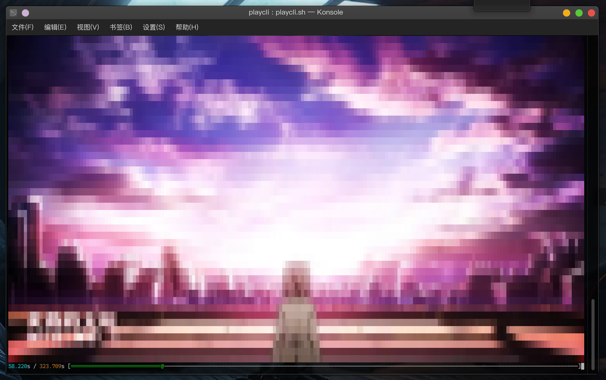
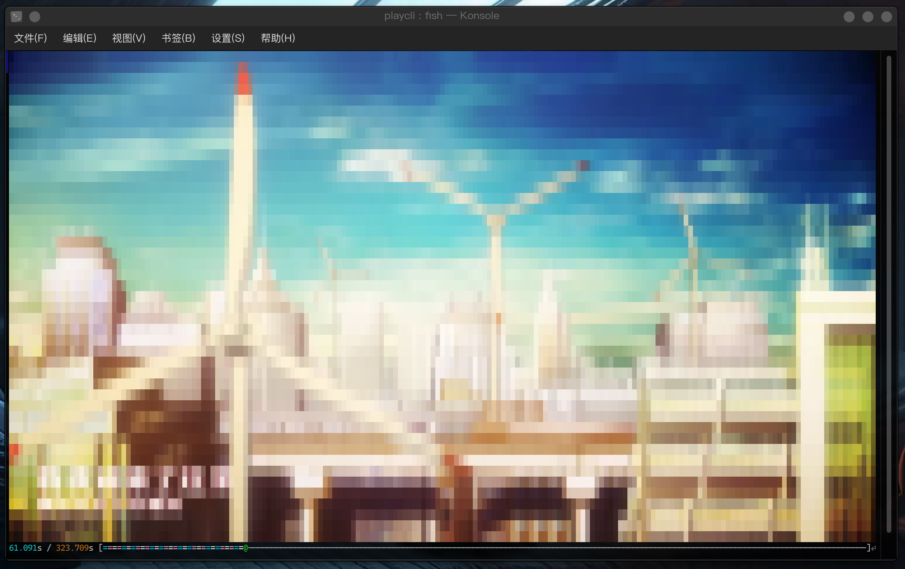
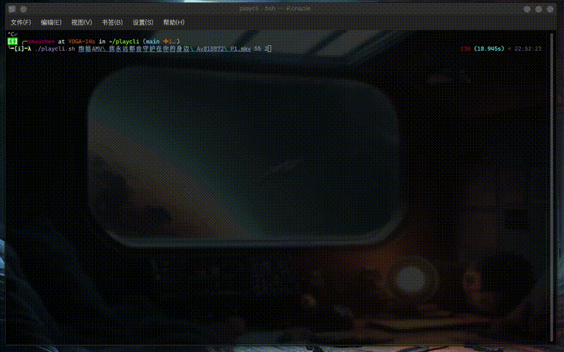

# playcli

Play vedio on your shell

## Description

It will automatically get the current window size and play with adaptive frame rate on your shell, and you can also set the start offset and playback speed.

## Dependents

- ffmpeg
- jp2a

You can run this command to install it on your debian-like system

`sudo apt install ffmpeg jp2a`

## Usage

```BASH
playcli.sh <your vedio> [offset_seconds [speed]]
```

## Examples

```BASH
playcli.sh 1.mkv
playcli.sh 1.mkv 114
playcli.sh 1.mkv 514 10
```






